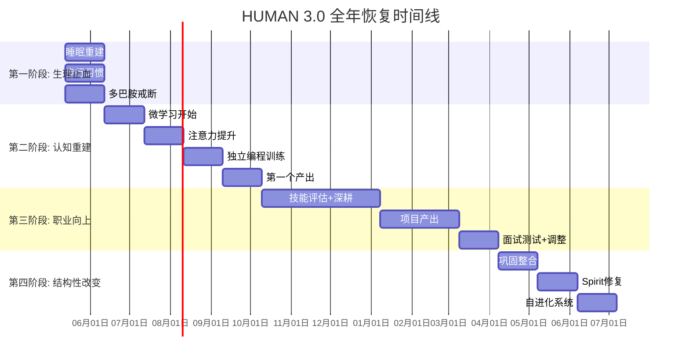

# 第四阶段：365日结构性改变计划

> 周期：第301-365天 + 全年回顾
> 前提：前三阶段达标——身体恢复 + 认知重建 + 职业向上
> 目标：从"修复"走向"成长",从"被动生存"走向"主动设计",形成可持续的自进化系统

---

## 一、全年成果总览（第365天预测）

如果前三个阶段全部达标,第365天你应该达到以下状态：

| 维度 | 第0天(当前) | 第365天目标 | 变化幅度 |
|------|-----------|------------|---------|
| Body 评分 | 1.2/10 | 5-6/10 | **+400%** |
| Mind 评分 | 3.0/10 | 6-7/10 | **+100%** |
| Spirit 评分 | 1.0/10 | 3-4/10 | **+200%** |
| Vocation 评分 | 3.2/10 | 5-6/10 | **+80%** |
| BMI | 27.4 | 24-26 | 下降5%体重 |
| 睡眠节律 | 混乱 | 规律(22:30-07:00) | 稳定 |
| 薪资 | 7k | 8-12k | **+40-70%** |
| 存款 | 9.5w | 12-15w | **+30-50%** |
| 自慰频率 | 2次/周 | ≤1次/2周 | **-75%** |
| 注意力持续 | 5-10分钟 | 45-60分钟 | **+400%** |
| AI依赖 | 必须用AI | AI是工具不是拐杖 | 可控 |
| 亲密关系 | 无 | 具备进入的基础能力 | **可持续方向** |

**这些不是梦想数字,是基于前三阶段依次达成的自然结果推导。** 它们在生理学和认知科学上都是可实现的——你唯一需要的是"持续执行"三个字。

---

## 二、第四阶段（第301-365天）的定位

第四阶段和前三个阶段不同——它不是新增一个"更难的任务",而是**巩固+整合+过渡**。

### 三个核心任务

| 任务 | 说明 | 预计时间 |
|------|------|---------|
| 1. 巩固前三阶段成果 | 防止回潮——让新习惯变成默认设置 | 持续 |
| 2. 开始处理 Spirit 象限 | 身体和职业稳定后,有余力处理关系问题 | 第301-335天 |
| 3. 建立自进化系统 | 让成长成为自动运行的程序,而不是外力推动 | 第335-365天 |

---

## 三、Spirit 象限的首次正式处理

前300天你都在其他象限修复自己。现在你第一次有足够的"心理余量"来面对 Spirit 的问题。

### 为什么是现在？

前两阶段的恢复顺序是：
```
Body(能量) → Mind(认知) → Vocation(职业)
```
这解决了80%的Spirit问题,因为：
- 身体恢复 = 自信提升(你不再感觉是"废人")
- 认知恢复 = 社交焦虑减轻(你不再社交恐惧)
- 职业恢复 = 自我价值感提升(你有了"我值这么多钱"的底气)

**剩下的20%**是纯粹的Spirit层问题：童年创伤修复、关系能力建设、人生意义构建。

### Spirit 层恢复的具体计划

| 周期 | 行动 | 原理 | 缓冲 |
|------|------|------|------|
| 第301-315天 | 每周1次线下社群活动(技术Meetup/读书会/运动小组) | 建立低压力社交暴露 | 只参加,不要求说话 |
| 第316-330天 | 开始写"情绪识别日志",标注每天的社交互动质量 | 训练对人际互动的觉察 | 写3条就算完成 |
| 第331-345天 | 建立一个稳定的社交锚点(加入一个固定活动的社群) | 建立可持续的关系结构 | 可不去,但知道有退路 |
| 第346-365天 | 回顾全年,+对未来3年做方向性规划 | 意义构建+长期框架 | 不需要很精准 |

### 关于"下跪心理"的专门处理

到第300天时,你的下跪心理应该已经大幅减轻——因为身体不再向你发送"我弱"的信号,大脑不再使用12岁的保护策略。

**剩余部分需要认知行为方法：**

```
当"下跪冲动"出现时:
  第1步: 识别——"这个感觉又来了。这是旧的保护回路。"
  第2步: 暂停——不要顺着感觉行动,深呼吸3次
  第3步: 替代——在脑中替换为: "我是26岁的成年人。我有工作、有存款、有选择。我不需要向任何人下跪。"
  第4步: 记录——记下触发场景,用于后续模式识别
```

这个过程不需要完美。只需要每次出现时做到一次,神经通路就会逐渐被新回路覆盖。

### 关于亲密关系的重新理解

到第365天,你仍然可能没有女朋友。这不重要。

重要的是,你从"没有资格被爱的人"变成了"有能力去爱的人了"。这两者的区别是：

| 状态 | 特征 | 关系风险 |
|------|------|---------|
| "被拯救模式" | 我需要一个人来救我 | 对对方极端依赖,无法承受波动 |
| "有能力给予模式" | 我已经有稳定的生活,希望与人分享 | 对关系有健康的期待和边界 |

**当前目标不是"找一个女朋友",而是"成为能维系健康关系的人"。** 前者可能在一天内意外发生,后者需要持续的自我建设。

---

## 四、自进化系统的建立

这是本阶段的终极目标：让成长变成你不费力就会做的事。

### 自进化系统的三要素

```
1. 锚点习惯(已建立)
   - 睡眠节律
   - 每日步行
   - 固定学习时间
   这些已经不需要意志力来维持

2. 反馈回路(正在建立)
   - 每日日志(简单记录执行情况)
   - 周复盘(1小时,分析本周数据)
   - 月复盘(根据数据调整策略)
   这些让"进步"可以量化,而不是靠感觉

3. 扩展框架(本阶段建立)
   - 季度目标设定
   - 年度方向调整
   - 基于能力和兴趣的自我导航
   这些让成长方向从"修复缺陷"转为"绽放优势"
```

### 日常运行模版

**每日(5分钟):**
```
[ ] 睡眠达标
[ ] 步行完成
[ ] 学习?30min
[ ] 娱乐<1.5h
[ ] 一句话状态
```

**每周(30分钟,周日晚):**
```
本周最有价值的学习:
本周最大的困难:
下周的调整:
```

**每月(1小时,最后一天):**
```
本月目标完成情况:
本月发现了什么模式?
下月重点调整:
```

**每季(2小时,季度末):**
```
本季度主要成果:
能力变化:
下季度方向:
```

---

## 五、第301-365天的日计划

第四阶段的日常节奏与前三个阶段不同——它不再需要严格的"治疗性"框架,而是"维护+拓展"模式。

```
┌─────────┬───────────────────────────┬──────────┐
│  时间   │  活动                     │  容错    │
├─────────┼───────────────────────────┼──────────┤
│ 07:30   │ 自然醒(不再是挣扎着起床)  │ 生物钟   │
│ 08:00-18:00│工作+日常               │ 熟练    │
│ 18:30-19:00│步行或轻度运动           │ 可选    │
│ 19:00-20:00│学习/社交/自己的项目     │ 灵活    │
│ 20:00-21:00│自由/阅读/关系维护       │ 放松    │
│ 21:00-22:00│关机+放松                │ 习惯    │
│ 22:00-07:30│睡眠                     │ 自然    │
└─────────┴───────────────────────────┴──────────┘
```

**这个阶段不再需要严格的分钟级控制。** 你的生物钟和习惯已经成为你的自动驾驶系统。你只需要在关键节点（如遇到重大挫折或生活事件）进行手动干预。

---

## 六、365天后的长期展望

### 短期（第2年）

| 维度 | 方向 | 可能的目标 |
|------|------|-----------|
| 职业 | 稳定在8-12k,向技术深度或管理方向选择 | 成为团队核心成员或技术负责人 |
| 财务 | 存款稳定增长至15-20w | 开始基金的适度配置(10%资金) |
| 身体 | BMI正常+甲亢控制良好 | 每周正常运动3次 |
| 关系 | 开始建立健康的社交圈 | 参与1-2个固定社群活动 |
| 认知 | 持续学习,每年1-2个新技能 | 每月完成一个小项目 |

### 中期（第3-5年）

- 职业: 向技术专家或技术管理方向发展
- 财务: 储蓄率保持在30%以上,资产配置多元化
- 身体: 将健康管理内化,变为生活方式的一部分
- 关系: 具备维系长期亲密关系的能力

### 长期（第5-10年）

- 从"修复自身"转向"创造价值"
- 可能的方向: 将技术能力与个人兴趣结合,创造独特的社会价值

---

## 七、全年时间线概览



---

## 八、全年风险管理

### 风险1：中途放弃

| 放弃时间点 | 概率 | 应对策略 |
|-----------|------|---------|
| 第1-7天 | 最高 | 告诉自己:"只需要熬过这7天。7天后可以重新决定。" |
| 第14-21天 | 高 | 戒断反应→正常。降低标准到"只要不恶化" |
| 第2个月末 | 中 | 看不到变化→拉长时间线,延长第一阶段 |
| 第4个月末 | 中 | 第一个困难期→回顾日志,看10周前的起点 |
| 第6个月末 | 低 | 遇到瓶颈→正常,不是失败 |
| 第9个月 | 极低 | 已经成为生活方式 |

### 风险2：生活事件（生病、失业、家庭变故）

**应对原则：**
1. **所有计划暂停。** 处理生活事件优先。
2. **只保留睡眠+吃饭两个基础习惯。** 即使其他全部中断,只要这两个维持,恢复周期只需2周。
3. **事件结束后,从当前阶段的最基础版重新开始。** 不追进度。
4. **允许回到前一阶段。** 如果生活事件导致身体严重恶化,回到第一阶段(30天生理止血)重新开始。

### 风险3：完美主义陷阱

```
"今天没做到 → 我失败了 → 明天也放弃算了"
↓
不要落入这个逻辑
↓
"今天没做到 → 原因是什么？ → 明天调整后重新开始"
```

**全年允许"连续失败"的天数：14天。** 在12个月中,完全允许有2周的时间不在状态。第15天要是还没回来,才需要检查。

---

## 九、最终提醒——为什么这个计划会不同

你过去的每一次"尝试改变"都失败了。为什么这次会不同？

### 过去你失败的原因清单

| 原因 | 在本计划中的对应解决方案 |
|------|------------------------|
| 目标太大(一天改全部) | 分解为4个阶段,每个阶段只有一个核心任务 |
| 依赖意志力 | 前30天全部靠环境设计,不需要意志力 |
| 没有缓冲 | 每个计划都内建了50%以上的缓冲空间 |
| 忽视身体条件 | Body是所有计划的起点和判断依据 |
| 把反思当行动 | 每个月只有一个可衡量的标准:你做了没有 |
| 多线作战 | 每个阶段只聚焦一个象限 |
| 没有底线保护 | 设计了"连续失败"的宽容机制 |
| 想一步到位 | 接受365天的时间跨度 |

### 最终的安心

**你不需要成为另一个人。你不需要"大彻大悟"。你不需要找到人生的意义。**

你只需要：
1. **今晚把手机放客厅。**
2. **明天出门走15分钟。**
3. **连续做3天。**
4. **然后,继续。**

这样重复365天,你会惊讶地发现自己变成了另一个人——不是因为做了某件惊天动地的事,是因为每天都做了几百件微不足道的事。

---

> *"你无法在产生问题的同一层意识上解决问题。"*
> ——爱因斯坦(但也是HUMAN 3.0的核心原理)
>
> 你不是在修复一个"坏掉的人",你是在升级一个"低电量模式的操作系统"。**
> 充电器已经插上了。现在,只是等待它充满的过程。
